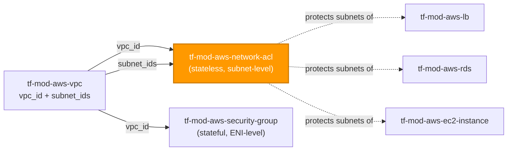
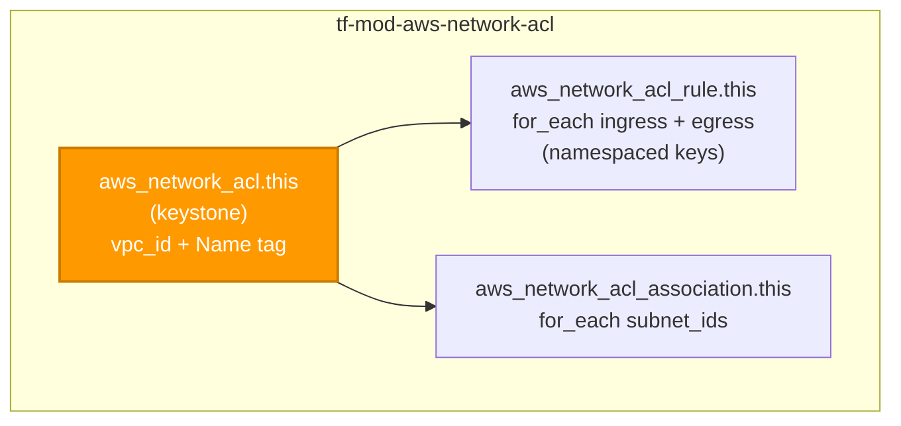

# 🟧 AWS **Network ACL** Terraform Module

> **Provisions a subnet-level Network ACL together with its numbered ingress/egress rules and its subnet associations — a complete, stateless, defense-in-depth boundary from one module call.** Built for the AWS provider **v6.x**.

[](https://www.terraform.io)
[](https://registry.terraform.io/providers/hashicorp/aws/latest)
[](#)
[](#)
[](#)

---

## 🧩 Overview

- 🧱 **One NACL, fully wired.** Creates `aws_network_acl` plus everything that is meaningless without it: its numbered `aws_network_acl_rule` entries and its `aws_network_acl_association` subnet bindings.
- 🚦 **Stateless, deny-all baseline.** A freshly created NACL denies all traffic until you add explicit rules — **nothing** is allowed implicitly. The empty default (`{}`) is a deny-all subnet boundary.
- 🔢 **Numbered rules, keyed `for_each`.** Ingress and egress arrive as two readable maps keyed by stable caller labels; adding or removing one rule never renumbers or re-associates the others.
- 🔁 **Return traffic is your job.** Because NACLs are stateless, an inbound allow almost always needs a matching outbound allow on the ephemeral port range (typically `1024–65535`) and vice versa.
- 🏷️ **Tags on the NACL.** `var.tags` flows to the network ACL and merges with provider `default_tags`; the merged set is surfaced as `tags_all`. (Rules and associations are not taggable in the AWS API.)
- 🌐 **Regional, VPC-scoped.** No `region` variable — the NACL is created in the same Region/VPC as the `vpc_id` / `subnet_ids` you wire in.

> 💡 **Why it matters:** Security groups (stateful) are the primary control, but a coarse, stateless **subnet-level backstop** is what stops a misconfigured SG from becoming an open door. In a regulated FI handling PII, that second layer is not optional — it is defense-in-depth.

---

## ❤️ Support this project

If these Terraform modules have been helpful to you or your organization, I'd appreciate your support in any of the following ways:

- ⭐ **Star this repository** to help others discover this Terraform module.
- 🤝 **Connect with me on LinkedIn:** [linkedin.com/in/microsoftexpert](https://www.linkedin.com/in/microsoftexpert)
- ☕ **Buy me a coffee:** [buymeacoffee.com/microsoftexpert](https://buymeacoffee.com/microsoftexpert)

Whether it's a star, a professional connection, or a coffee, every gesture helps keep these modules actively maintained and continually improving. Thank you for being part of the community!

---

## 🗺️ Where this fits in the family

`tf-mod-aws-network-acl` sits in the **networking** layer alongside `tf-mod-aws-security-group`. It consumes `vpc_id` and `subnet_ids` from `tf-mod-aws-vpc` and protects the same subnets that compute, database, and load-balancing modules launch into.



---

## 🧬 What this module builds



| Resource | Count | Created when |
|---|---|---|
| `aws_network_acl.this` | 1 | always (keystone) |
| `aws_network_acl_rule.this` | 0..N | one per `ingress_rules` + `egress_rules` entry |
| `aws_network_acl_association.this` | 0..N | one per `subnet_ids` entry |

> ℹ️ Ingress and egress maps are merged in `locals` into a single keyed collection (`ingress/<label>`, `egress/<label>`) so the module owns **one** rule resource and an ingress rule may reuse the same caller label as an egress rule without colliding.

---

## ✅ Provider / Versions

| Requirement | Version |
|---|---|
| Terraform | `>= 1.12.0` |
| `hashicorp/aws` | `>= 6.0, < 7.0` |

The module declares only a `required_providers` block (`providers.tf`) and inherits the configured provider. There is **no `provider {}` block** and **no credential variable** — credentials resolve through the standard AWS chain at the root/pipeline level (env vars → SSO/shared credentials → `assume_role` → instance profile / IRSA → OIDC web identity).

---

## 🔑 Required IAM Permissions

Least-privilege actions the **Terraform execution identity** needs to manage this module.

| Action | Required for | Notes |
|---|---|---|
| `ec2:CreateNetworkAcl`, `ec2:DeleteNetworkAcl` | NACL lifecycle | Core create/destroy of `aws_network_acl` |
| `ec2:DescribeNetworkAcls` | Read / refresh | Plan & state refresh |
| `ec2:CreateNetworkAclEntry`, `ec2:DeleteNetworkAclEntry` | Numbered rules | One entry per `ingress_rules` / `egress_rules` item |
| `ec2:ReplaceNetworkAclEntry` | Rule updates | Renumbering / changing a rule replaces the entry |
| `ec2:ReplaceNetworkAclAssociation` | Subnet associations | Moves a subnet onto this NACL (an association is a *replace*, not an add) |
| `ec2:CreateTags`, `ec2:DeleteTags` | Tagging | On `aws_network_acl` only; scope to `ec2:CreateAction = CreateNetworkAcl` |

> ⚠️ **No `iam:PassRole`, no service-linked role.** The network ACL service requires neither.

> 🔒 Scope these actions with a condition on `ec2:Vpc` (the ARN of the target VPC) so the execution identity can only manage NACLs inside the VPCs it owns.

---

## 📋 AWS Prerequisites

- **No service-linked role** is required for network ACLs.
- **No account opt-in** is required.
- **VPC + subnets must exist.** Wire `vpc_id` and `subnet_ids` from `tf-mod-aws-vpc`. The NACL is **regional and VPC-scoped** — it must be created in the same Region as the VPC and subnets it protects.
- **Region.** Do **not** set a `region` variable; the caller's provider configuration selects the Region. There is **no `us-east-1` global-resource constraint** for NACLs.
- **Quotas** (per [Amazon VPC quotas → Network ACLs](https://docs.aws.amazon.com/vpc/latest/userguide/amazon-vpc-limits.html)):
 - **200 network ACLs per VPC** (adjustable via Service Quotas).
 - **20 inbound + 20 outbound rules** per NACL by default — raisable to **40 inbound + 40 outbound** (80 total), though network performance may be impacted at the higher limit.
 - Rule numbers must be **unique within a direction**, in the range **1–32766** (rule `32767` is the reserved, unmanaged implicit deny).
- **One NACL per subnet.** Every subnet is associated with exactly one NACL — associating it here **moves** it off the VPC default NACL.

---

## 📁 Module Structure

```
tf-mod-aws-network-acl/
├── providers.tf # required_providers (aws >= 6.0, < 7.0); no provider block
├── variables.tf # name → vpc_id → ingress_rules → egress_rules → subnet_ids → tags
├── main.tf # aws_network_acl.this + rule (for_each) + association (for_each)
├── outputs.tf # id + arn + network_acl_id + vpc_id + rules + associations + tags_all
├── README.md # this file
└── SCOPE.md # in/out-of-scope, IAM permissions, prerequisites, gotchas
```

---

## ⚙️ Quick Start

Smallest working call — a private-subnet NACL allowing HTTPS in and ephemeral return traffic out, wired from `tf-mod-aws-vpc`:

```hcl
module "app_nacl" {
  source = "git::https://github.com/microsoftexpert/tf-mod-aws-network-acl?ref=v1.0.0"

  name   = "casey-app-private"
  vpc_id = module.vpc.vpc_id

  ingress_rules = {
    https-in = { rule_number = 100, protocol = "tcp", rule_action = "allow", cidr_block = "10.0.0.0/8", from_port = 443, to_port = 443 }
  }

  egress_rules = {
    ephemeral-out = { rule_number = 100, protocol = "tcp", rule_action = "allow", cidr_block = "10.0.0.0/8", from_port = 1024, to_port = 65535 }
  }

  subnet_ids = {
    app-a = module.vpc.private_subnet_ids["a"]
    app-b = module.vpc.private_subnet_ids["b"]
  }

  tags = {
    Environment = "prod"
    DataClass   = "internal"
  }
}
```

---

## 🔌 Cross-Module Contract

### Consumes

| Input | Type | Source module |
|---|---|---|
| `vpc_id` | `string` (VPC id) | `tf-mod-aws-vpc` |
| `subnet_ids` | `map(string)` (subnet ids, caller-labeled) | `tf-mod-aws-vpc` |

> Networking module — it needs `vpc_id` from an upstream VPC; `subnet_ids` is optional (omit to leave subnets on the default NACL).

### Emits

| Output | Description | Consumed by |
|---|---|---|
| `id` | NACL id (`acl-…`) | references / CLI / audit |
| `arn` | NACL ARN `arn:aws:ec2:<region>:<account>:network-acl/<id>` — the cross-resource reference type | IAM / SCP policy resource references |
| `network_acl_id` | Alias of `id` for explicit cross-module wiring | route/subnet documentation, audits |
| `vpc_id` | The VPC the NACL belongs to | inventory / audit |
| `owner_id` | AWS account id that owns the NACL | audit |
| `rule_ids` | Map of namespaced rule key → rule resource id | drift inspection |
| `rules` | Map of namespaced rule key → `{ rule_number, egress, protocol, rule_action }` | drift inspection / audit |
| `association_ids` | Map of subnet id → association id | audit |
| `tags_all` | All tags incl. provider `default_tags` (resource tags win) | governance/audit |

---

## 📚 Example Library

<details>
<summary><strong>1 · Minimal — NACL only (deny-all baseline, no rules, no subnets)</strong></summary>

```hcl
module "baseline_nacl" {
  source = "git::https://github.com/microsoftexpert/tf-mod-aws-network-acl?ref=v1.0.0"

  name   = "casey-baseline"
  vpc_id = module.vpc.vpc_id
  # no ingress_rules, egress_rules, or subnet_ids → an empty, deny-all NACL
  # not yet associated with any subnet. The secure starting point.
}
```
</details>

<details>
<summary><strong>2 · HTTPS in + ephemeral return out (the stateless pattern)</strong></summary>

```hcl
module "web_nacl" {
  source = "git::https://github.com/microsoftexpert/tf-mod-aws-network-acl?ref=v1.0.0"

  name   = "casey-web"
  vpc_id = module.vpc.vpc_id

  ingress_rules = {
    https-in = { rule_number = 100, protocol = "tcp", rule_action = "allow", cidr_block = "0.0.0.0/0", from_port = 443, to_port = 443 }
  }

  egress_rules = {
    # NACLs are STATELESS — the reply to an inbound 443 leaves from an ephemeral port.
    ephemeral-out = { rule_number = 100, protocol = "tcp", rule_action = "allow", cidr_block = "0.0.0.0/0", from_port = 1024, to_port = 65535 }
  }

  subnet_ids = { public-a = module.vpc.public_subnet_ids["a"] }
}
```
</details>

<details>
<summary><strong>3 · Tags (merge with provider <code>default_tags</code>)</strong></summary>

```hcl
# Caller's provider block owns default_tags; the module never sets it.
provider "aws" {
  default_tags { tags = { Owner = "platform", ManagedBy = "terraform" } }
}

module "tagged_nacl" {
  source = "git::https://github.com/microsoftexpert/tf-mod-aws-network-acl?ref=v1.0.0"

  name   = "casey-tagged" # applied as the Name tag; wins over any Name key in var.tags
  vpc_id = module.vpc.vpc_id

  tags = {
    Environment = "prod" # resource tag — wins over default_tags on key conflict
    DataClass   = "internal"
  }
}

# module.tagged_nacl.tags_all == { Owner, ManagedBy, Environment, DataClass, Name = "casey-tagged" }
```
</details>

<details>
<summary><strong>4 · IPv6 rules</strong></summary>

```hcl
module "ipv6_nacl" {
  source = "git::https://github.com/microsoftexpert/tf-mod-aws-network-acl?ref=v1.0.0"

  name   = "casey-dualstack"
  vpc_id = module.vpc.vpc_id

  ingress_rules = {
    https-v6-in = { rule_number = 100, protocol = "tcp", rule_action = "allow", ipv6_cidr_block = "::/0", from_port = 443, to_port = 443 }
  }

  egress_rules = {
    ephemeral-v6-out = { rule_number = 100, protocol = "tcp", rule_action = "allow", ipv6_cidr_block = "::/0", from_port = 1024, to_port = 65535 }
  }
}
```
</details>

<details>
<summary><strong>5 · Explicit deny before a broad allow (lower number wins)</strong></summary>

```hcl
module "deny_then_allow_nacl" {
  source = "git::https://github.com/microsoftexpert/tf-mod-aws-network-acl?ref=v1.0.0"

  name   = "casey-blocklist"
  vpc_id = module.vpc.vpc_id

  ingress_rules = {
    # Evaluated first (lowest number) — blocks a known-bad range outright.
    deny-bad-actor = { rule_number = 50, protocol = "-1", rule_action = "deny", cidr_block = "203.0.113.0/24" }
    allow-corp     = { rule_number = 100, protocol = "tcp", rule_action = "allow", cidr_block = "10.0.0.0/8", from_port = 443, to_port = 443 }
  }
}
```
</details>

<details>
<summary><strong>6 · ICMP (allow ping/diagnostics from the VPC)</strong></summary>

```hcl
module "icmp_nacl" {
  source = "git::https://github.com/microsoftexpert/tf-mod-aws-network-acl?ref=v1.0.0"

  name   = "casey-diag"
  vpc_id = module.vpc.vpc_id

  ingress_rules = {
    icmp-in = { rule_number = 100, protocol = "icmp", rule_action = "allow", cidr_block = "10.0.0.0/8", icmp_type = -1, icmp_code = -1 }
  }
  egress_rules = {
    icmp-out = { rule_number = 100, protocol = "icmp", rule_action = "allow", cidr_block = "10.0.0.0/8", icmp_type = -1, icmp_code = -1 }
  }
}
```
</details>

<details>
<summary><strong>7 · Database-tier NACL (allow Postgres from app subnets only)</strong></summary>

```hcl
module "db_nacl" {
  source = "git::https://github.com/microsoftexpert/tf-mod-aws-network-acl?ref=v1.0.0"

  name   = "casey-db"
  vpc_id = module.vpc.vpc_id

  ingress_rules = {
    pg-from-app = { rule_number = 100, protocol = "tcp", rule_action = "allow", cidr_block = "10.0.16.0/20", from_port = 5432, to_port = 5432 }
  }
  egress_rules = {
    ephemeral-to-app = { rule_number = 100, protocol = "tcp", rule_action = "allow", cidr_block = "10.0.16.0/20", from_port = 1024, to_port = 65535 }
  }

  subnet_ids = {
    db-a = module.vpc.database_subnet_ids["a"]
    db-b = module.vpc.database_subnet_ids["b"]
  }
}
# Pairs with a stateful tf-mod-aws-security-group on the RDS instance — NACL is the coarse backstop.
```
</details>

<details>
<summary><strong>8 · Associating multiple subnets (one NACL, many subnets)</strong></summary>

```hcl
module "shared_nacl" {
  source = "git::https://github.com/microsoftexpert/tf-mod-aws-network-acl?ref=v1.0.0"

  name   = "casey-private-shared"
  vpc_id = module.vpc.vpc_id

  egress_rules = {
    all-out = { rule_number = 100, protocol = "-1", rule_action = "allow", cidr_block = "0.0.0.0/0" }
  }

  # Keys are stable caller labels — re-pointing one subnet never churns the others.
  subnet_ids = {
    app-a = module.vpc.private_subnet_ids["a"]
    app-b = module.vpc.private_subnet_ids["b"]
    app-c = module.vpc.private_subnet_ids["c"]
  }
}
```
</details>

<details>
<summary><strong>9 · Allow-all egress with restricted ingress (common private-subnet shape)</strong></summary>

```hcl
module "private_nacl" {
  source = "git::https://github.com/microsoftexpert/tf-mod-aws-network-acl?ref=v1.0.0"

  name   = "casey-private"
  vpc_id = module.vpc.vpc_id

  ingress_rules = {
    from-vpc     = { rule_number = 100, protocol = "-1", rule_action = "allow", cidr_block = "10.0.0.0/16" }
    ephemeral-in = { rule_number = 200, protocol = "tcp", rule_action = "allow", cidr_block = "0.0.0.0/0", from_port = 1024, to_port = 65535 }
  }

  egress_rules = {
    all-out = { rule_number = 100, protocol = "-1", rule_action = "allow", cidr_block = "0.0.0.0/0" }
  }
}
```
</details>

<details>
<summary><strong>10 · UDP (DNS) rules</strong></summary>

```hcl
module "dns_nacl" {
  source = "git::https://github.com/microsoftexpert/tf-mod-aws-network-acl?ref=v1.0.0"

  name   = "casey-resolver"
  vpc_id = module.vpc.vpc_id

  egress_rules = {
    dns-udp-out = { rule_number = 100, protocol = "udp", rule_action = "allow", cidr_block = "10.0.0.2/32", from_port = 53, to_port = 53 }
    dns-tcp-out = { rule_number = 110, protocol = "tcp", rule_action = "allow", cidr_block = "10.0.0.2/32", from_port = 53, to_port = 53 }
  }
  ingress_rules = {
    dns-ephemeral-in = { rule_number = 100, protocol = "udp", rule_action = "allow", cidr_block = "10.0.0.2/32", from_port = 1024, to_port = 65535 }
  }
}
```
</details>

<details>
<summary><strong>11 · IANA protocol number as a string (e.g. ESP / protocol 50)</strong></summary>

```hcl
module "vpn_nacl" {
  source = "git::https://github.com/microsoftexpert/tf-mod-aws-network-acl?ref=v1.0.0"

  name   = "casey-ipsec"
  vpc_id = module.vpc.vpc_id

  ingress_rules = {
    esp-in = { rule_number = 100, protocol = "50", rule_action = "allow", cidr_block = "198.51.100.0/24" } # ports ignored for non-TCP/UDP
  }
}
```
</details>

<details>
<summary><strong>12 · Multi-Region via provider alias (NACL follows its VPC's Region)</strong></summary>

```hcl
# A NACL must live in the same Region as its VPC. There is NO us-east-1 global
# constraint here — you simply pass whichever provider points at the VPC's Region.
module "eu_nacl" {
  source    = "git::https://github.com/microsoftexpert/tf-mod-aws-network-acl?ref=v1.0.0"
  providers = { aws = aws.eu_west_1 }

  name       = "casey-eu-app"
  vpc_id     = module.eu_vpc.vpc_id # eu_vpc also built with aws.eu_west_1
  subnet_ids = { app-a = module.eu_vpc.private_subnet_ids["a"] }

  egress_rules = { all-out = { rule_number = 100, protocol = "-1", rule_action = "allow", cidr_block = "0.0.0.0/0" } }
}
```
</details>

<details>
<summary><strong>13 · Secure-by-default opt-out — wide-open NACL (exception, use with care)</strong></summary>

```hcl
# The secure default is deny-all. This example RELAXES it to allow-all both ways.
# Document the justification in your root module; an SG should still constrain the ENI.
module "permissive_nacl" {
  source = "git::https://github.com/microsoftexpert/tf-mod-aws-network-acl?ref=v1.0.0"

  name   = "casey-lab-open" # non-prod / lab only
  vpc_id = module.vpc.vpc_id

  ingress_rules = { allow-all-in = { rule_number = 100, protocol = "-1", rule_action = "allow", cidr_block = "0.0.0.0/0" } }
  egress_rules  = { allow-all-out = { rule_number = 100, protocol = "-1", rule_action = "allow", cidr_block = "0.0.0.0/0" } }

  subnet_ids = { lab-a = module.vpc.private_subnet_ids["a"] }
}
```
</details>

<details>
<summary><strong>14 · End-to-end composition — VPC + NACL + SG protecting an app tier</strong></summary>

```hcl
# Networking foundation
module "vpc" {
  source = "git::https://github.com/microsoftexpert/tf-mod-aws-vpc?ref=v1.0.0"
  name   = "casey-core"
  cidr   = "10.0.0.0/16"
  #... subnets, NAT, flow logs
}

# Stateful, ENI-level control (primary)
module "app_sg" {
  source = "git::https://github.com/microsoftexpert/tf-mod-aws-security-group?ref=v1.0.0"
  name   = "casey-app"
  vpc_id = module.vpc.vpc_id
  #... ingress 443 from the ALB SG, egress to DB
}

# Stateless, subnet-level backstop (this module)
module "app_nacl" {
  source = "git::https://github.com/microsoftexpert/tf-mod-aws-network-acl?ref=v1.0.0"

  name   = "casey-app-private"
  vpc_id = module.vpc.vpc_id

  ingress_rules = {
    https-in     = { rule_number = 100, protocol = "tcp", rule_action = "allow", cidr_block = "10.0.0.0/16", from_port = 443, to_port = 443 }
    ephemeral-in = { rule_number = 200, protocol = "tcp", rule_action = "allow", cidr_block = "0.0.0.0/0", from_port = 1024, to_port = 65535 }
  }

  egress_rules = {
    all-out = { rule_number = 100, protocol = "-1", rule_action = "allow", cidr_block = "0.0.0.0/0" }
  }

  subnet_ids = {
    app-a = module.vpc.private_subnet_ids["a"]
    app-b = module.vpc.private_subnet_ids["b"]
  }

  tags = { Environment = "prod", DataClass = "internal" }
}
# Two layers, one VPC: the SG decides per-ENI; the NACL is the coarse subnet boundary.
```
</details>

---

## 📥 Inputs

| Name | Type | Default | Description |
|---|---|---|---|
| `name` | `string` | `null` | Logical name, surfaced as the `Name` tag (NACLs have no native name). Overrides any `Name` key in `tags`. |
| `vpc_id` | `string` | — **required** | VPC the NACL is created in. **FORCE-NEW** — a NACL cannot move VPCs. |
| `ingress_rules` | `map(object({...}))` | `{}` | Inbound rules keyed by stable label; rendered as `aws_network_acl_rule` with `egress = false`. |
| `egress_rules` | `map(object({...}))` | `{}` | Outbound rules — same schema as `ingress_rules`, numbered independently. |
| `subnet_ids` | `map(string)` | `{}` | Subnet associations keyed by stable label → subnet id. Moves each subnet off the default NACL. |
| `tags` | `map(string)` | `{}` | Tags for the NACL (merge with `default_tags`; resource tags win). |

Each rule object: `rule_number` (1–32766, required), `protocol` (`"-1"`/`tcp`/`udp`/`icmp`/`icmpv6`/IANA number string, required), `rule_action` (`allow`/`deny`, required), exactly one of `cidr_block` / `ipv6_cidr_block`, and optional `from_port` / `to_port` / `icmp_type` / `icmp_code`. See `variables.tf` for full heredoc schemas and validation rules.

---

## 🧾 Outputs

| Name | Description |
|---|---|
| `id` | NACL id (`acl-…`). |
| `arn` | NACL ARN (cross-resource reference type). |
| `network_acl_id` | Alias of `id` for explicit cross-module wiring. |
| `vpc_id` | VPC the NACL belongs to. |
| `owner_id` | AWS account id that owns the NACL. |
| `rule_ids` | Map of namespaced rule key (`ingress/<label>`, `egress/<label>`) → rule resource id. |
| `rules` | Map of namespaced rule key → `{ rule_number, egress, protocol, rule_action }`. |
| `association_ids` | Map of subnet id → association id. |
| `tags_all` | All tags incl. provider `default_tags`. |

---

## 🧠 Architecture Notes

- **ARN format:** `arn:aws:ec2:<region>:<account-id>:network-acl/<acl-id>`. Unlike IAM, this is a **regional** resource — the ARN carries a region segment.
- **ID format:** the `id` is the NACL id `acl-0123456789abcdef0`. Association ids are `aclassoc-…`; rule entries have no AWS id of their own (the Terraform resource id is a synthetic `<acl-id>:<rule_number>:<egress>:…` composite, surfaced as `rule_ids`).
- **Force-new fields:** `vpc_id` is **force-new** — a NACL cannot move VPCs, so changing it destroys and recreates the NACL along with all its rules and associations.
- **Stateless evaluation.** NACLs evaluate inbound and outbound **independently** — there is no connection tracking. An inbound allow does **not** implicitly permit its reply; you must add a matching opposite-direction rule for the ephemeral port range (typically `1024–65535`, or the OS-specific range of your instances). This is the single most common NACL misconfiguration.
- **Rule numbering is significant.** Rules are evaluated low-to-high and the **first match wins**; rule `32767` is the unmanaged implicit deny-all. Reordering means renumbering, which **replaces** the affected rule resources (`ec2:ReplaceNetworkAclEntry`). Keys in the rule maps are stable labels, so adding/removing one rule never churns the others.
- **`tags` ↔ `tags_all` ↔ `default_tags`:** `var.tags` is applied to the NACL; `tags_all` is the provider-computed merge of resource tags over provider `default_tags`, with **resource tags winning** on key conflict. `default_tags` is configured in the caller's provider block — **never** inside this module. `aws_network_acl_rule` and `aws_network_acl_association` are **not taggable**.
- **`var.name` → `Name` tag.** A NACL has no native name argument; `var.name`, when set, is merged in as the `Name` tag and **overrides** any `Name` key supplied in `var.tags`.
- **Association is a move, not an add.** `aws_network_acl_association` reassigns a subnet from its current NACL (`ec2:ReplaceNetworkAclAssociation`). On destroy, each associated subnet **reverts to the VPC default NACL** — it is never left without a NACL.
- **Destroy ordering.** Rules and associations are deleted before the NACL; the resource graph handles this. A NACL still associated with subnets cannot be deleted — the module's association resources are torn down first.
- **Eventual consistency.** EC2 control-plane changes can lag briefly; a freshly created NACL or rule may not be immediately reflected in a separate Describe call, but in-graph dependencies make this transparent within a single apply.
- **us-east-1 globals:** N/A. NACLs are regional and VPC-scoped — no region-pinned provider alias is ever required.

---

## 🧱 Design Principles

Secure-by-default posture and every opt-out, explicitly:

| Posture | Default | Opt-out |
|---|---|---|
| Ingress / egress | caller-defined numbered rules; **no implicit allow** is added | add explicit `ingress_rules` / `egress_rules` |
| Fresh-NACL behavior | denies all traffic until rules are added (deny-all baseline) | add allow rules |
| Stateless return traffic | documented; the caller must add the matching ephemeral-port allow | n/a (inherent to NACLs) |
| Subnet association | explicit via `subnet_ids` | omit `subnet_ids` to leave subnets on the VPC default NACL |
| Region | none (provider-inherited; same Region as the VPC) | n/a |

> Network ACLs hold **no data at rest**, so encryption defaults are N/A. The secure posture here is the **deny-all baseline** plus the deliberate, layered relationship with security groups. Document each opt-out (especially Example 13's allow-all) in your root module so reviewers can see what was loosened.

Other principles:
- **One composite, one keystone.** The NACL owns only what is meaningless without it — its rules and its associations. The VPC and subnets it references are authored by `tf-mod-aws-vpc`.
- **`for_each`, never `count`,** for rules and associations — keyed by stable caller labels so reorders and single-item edits don't churn the plan or renumber unrelated rules.
- **Defense-in-depth, not a replacement.** Stateful security groups (`tf-mod-aws-security-group`) remain the primary, per-ENI control; the NACL is the coarse, stateless subnet-level backstop.
- **Primary outputs `id` + `arn`**, plus `network_acl_id`, the rule/association maps, and `tags_all`.

---

## 🚀 Runbook

```powershell
# Validate without backend or credentials
terraform init -backend=false
terraform validate
terraform fmt -check
```

> `plan` / `apply` require valid AWS credentials (profile / SSO / OIDC) resolved through the standard provider chain, plus the EC2 actions listed above and a configured Region. Always pin the module with `?ref=v1.0.0` — never a branch.

---

## 🧪 Testing

- `terraform init -backend=false && terraform validate` — schema + reference integrity.
- `terraform fmt -check` — canonical formatting.
- `terraform plan` against a sandbox VPC to confirm the NACL, its numbered rules, and the subnet associations materialize as expected.
- Assert `module.<name>.arn`, `rule_ids`, `association_ids`, and `tags_all` in your root-module test harness.
- Validation coverage: invalid `rule_number` (out of 1–32766), bad `rule_action`/`protocol`, and supplying both/neither of `cidr_block`/`ipv6_cidr_block` are all caught at `plan` time by `variables.tf` validations.

---

## 💬 Example Output

```text
module.app_nacl.aws_network_acl.this: Creation complete after 1s [id=acl-0a1b2c3d4e5f60718]
module.app_nacl.aws_network_acl_rule.this["ingress/https-in"]: Creation complete
module.app_nacl.aws_network_acl_rule.this["egress/ephemeral-out"]: Creation complete
module.app_nacl.aws_network_acl_association.this["app-a"]: Creation complete [id=aclassoc-0abc123...]

Outputs:
arn = "arn:aws:ec2:us-east-1:123456789012:network-acl/acl-0a1b2c3d4e5f60718"
id = "acl-0a1b2c3d4e5f60718"
network_acl_id = "acl-0a1b2c3d4e5f60718"
association_ids = { "subnet-0aaa..." = "aclassoc-0abc..." }
tags_all = { "DataClass" = "internal", "Environment" = "prod", "Name" = "casey-app-private" }
```

---

## 🔍 Troubleshooting

| Symptom | Likely cause | Fix |
|---|---|---|
| Inbound traffic allowed but replies time out | NACL is **stateless** — no matching ephemeral-port egress rule | Add an `egress_rules` entry allowing the ephemeral range (`1024–65535`) back to the source |
| Outbound requests succeed but responses are dropped | Missing inbound ephemeral allow | Add an `ingress_rules` entry for `1024–65535` from the destination |
| `NetworkAclEntryAlreadyExists` on apply | Two rules share a `rule_number` in the same direction | Rule numbers must be unique per direction; renumber one |
| Unexpected deny despite an allow rule | A lower-numbered rule matched first (first-match wins) | Lower the allow's `rule_number` or raise/remove the conflicting rule |
| A subnet's traffic changed unexpectedly | Associating it here **moved** it off its previous NACL | Confirm the intended `subnet_ids`; a subnet has exactly one NACL |
| `DependencyViolation` deleting the NACL | NACL still associated with subnets / VPC default cannot be deleted | The graph detaches associations first; ensure no out-of-band associations remain. Default NACLs are not managed here |
| Tag drift on every plan | A tag also set by provider `default_tags` with a different value | Let resource tags win, or remove the overlap from `default_tags` |
| `AccessDenied: ec2:CreateNetworkAclEntry` | Execution identity lacks rule permissions | Grant the EC2 actions in the Required IAM Permissions table, scoped to the VPC |
| Hit the 20-rule limit per direction | Default quota reached | Request an increase (up to 40 in / 40 out) via Service Quotas, or consolidate CIDRs |

---

## 🔗 Related Docs

- [Control subnet traffic with network ACLs](https://docs.aws.amazon.com/vpc/latest/userguide/vpc-network-acls.html)
- [Network ACL rules](https://docs.aws.amazon.com/vpc/latest/userguide/nacl-rules.html)
- [Amazon VPC quotas → Network ACLs](https://docs.aws.amazon.com/vpc/latest/userguide/amazon-vpc-limits.html)
- [Ephemeral ports](https://docs.aws.amazon.com/vpc/latest/userguide/nacl-rules.html#nacl-ephemeral-ports)
- Terraform: [`aws_network_acl`](https://registry.terraform.io/providers/hashicorp/aws/latest/docs/resources/network_acl) · [`aws_network_acl_rule`](https://registry.terraform.io/providers/hashicorp/aws/latest/docs/resources/network_acl_rule) · [`aws_network_acl_association`](https://registry.terraform.io/providers/hashicorp/aws/latest/docs/resources/network_acl_association)
- Sibling modules: `tf-mod-aws-vpc`, `tf-mod-aws-security-group`, `tf-mod-aws-lb`, `tf-mod-aws-rds`
- Module internals: `SCOPE.md`

---

> 🧡 *"Infrastructure as Code should be standardized, consistent, and secure."*
